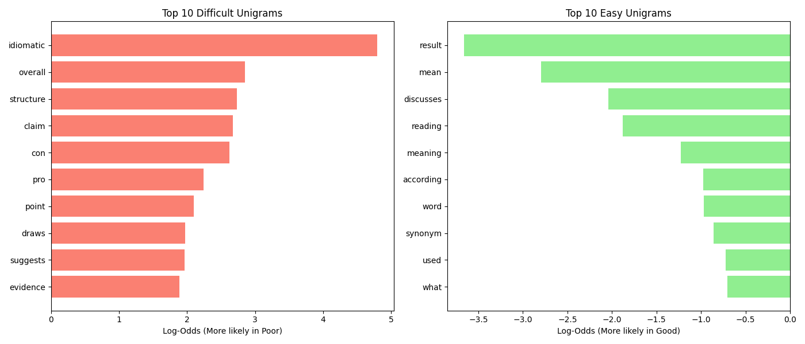
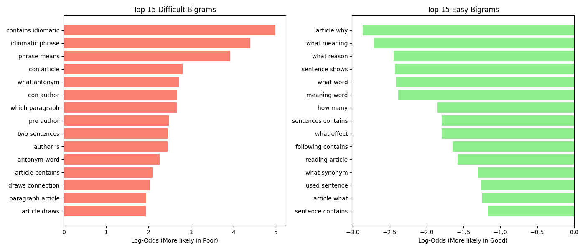

# Quiz Question Difficulty Analysis

## Quick Start

### Using Make

```bash
make create     # Create virtual environment and install dependencies
make start      # Open Jupyter notebook to run analysis
```

### Using Shell Script (alternative)

```bash
chmod +x setup.sh    # Make script executable (first time only)
./setup.sh create    # Create virtual environment and install dependencies
./setup.sh start     # Open Jupyter notebook to run analysis
```

Once Jupyter opens, navigate to [analysis.ipynb](analysis.ipynb) and optionally run all the cells to reproduce the analysis.

## Research Question

**What words or phrases appear more frequently in questions that students tend to do poorly on, and what appear more frequently in questions that students do well on?**

## Methodology

We compare the vocabulary of questions where students performed poorly versus well, using **balanced terciles** to ensure equal sample sizes for robust statistical comparison.

1. **Balanced Sampling:** Questions are divided using the 33rd and 67th percentiles of `percent_correct` (≤50.4% for difficult, ≥65.8% for easy), ensuring equal numbers of difficult and easy questions while excluding the middle range.
2. **Feature Extraction:** We analyze single words (unigrams) and two-word phrases (bigrams), removing common stopwords.
3. **Statistical Analysis:** We measure the association of each term with difficulty using the **Log-Odds Ratio** with **Haldane-Anscombe correction** (smoothing with 0.5).
4. **Significance Testing:** To identify statistically significant terms, we use **Fisher's Exact Test** for rare terms (expected frequency < 5) and the **Chi-Square Test** for common terms, applying the **Benjamini-Hochberg correction** to control the False Discovery Rate (FDR < 0.05).

## Key Findings

### Difficult Questions

Questions that students struggle with most often contain analysis-heavy language — terms like idiomatic, antonym, claim, argument, evidence, connection, central idea, and phrases such as best describes, provides evidence, draws connection, contains idiomatic phrase, or which paragraph. These generally require deeper reasoning, inference, or understanding of author intent.

In contrast, questions that students perform well on use simpler, more direct wording — terms like meaning, synonym, what word, how many, according to the article, and phrases like what meaning, uses word, what event, what synonym. These tend to ask for surface-level recall or straightforward definitions.

## Visualizations

### Top Significant Unigrams



### Top Significant Bigrams


